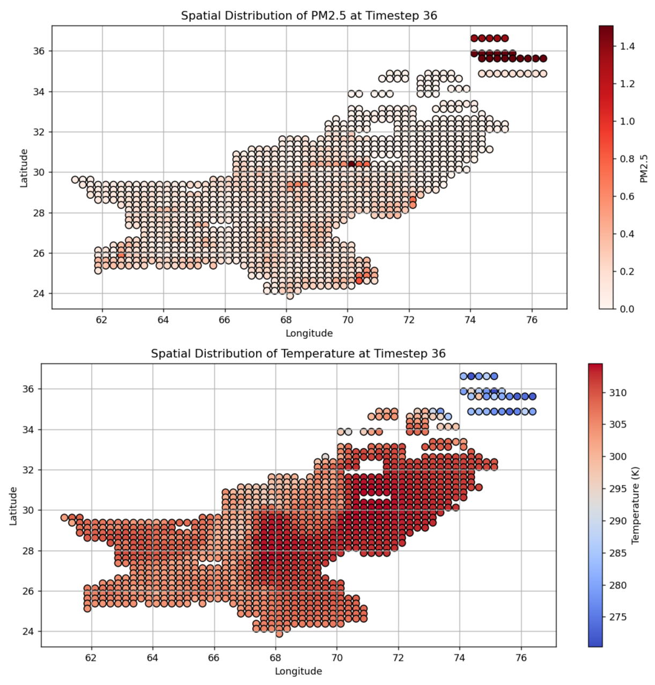

# PM2.5 vs Temperature

.

# PM2.5 map at timestep 129

.

# PM2.5 max at timestep 129

.

# Marginal Distribution of PM2.5 and Temperature

.

# Joint Distribution of PM2.5 and Temperature

.

# Pairwise relationships of PM2.5 and Temperature

.

# Relationship between PM2.5 trend and temp trend

.

# Spatial distribution of PM2.5 at Timestep 36

.

| Longitude | Latitude | Timestep |   PM2.5   | Temperature |
|-----------|----------|----------|-----------|-------------|
|   71.375  |  34.875  |    1     |   0.009   |   277.689331|
|   71.625  |  34.875  |    1     |   0.009   |   279.305786|
|   71.875  |  34.875  |    1     |   0.009   |   281.487152|
|   72.125  |  34.875  |    1     |   0.009   |   273.427643|
|   72.375  |  34.875  |    1     |   0.009   |   277.265686|

# PM2.5 Video

[Watch the video](Figures/pm25_variance_t001.png 2025-11-17 10-12-00.mp4)

