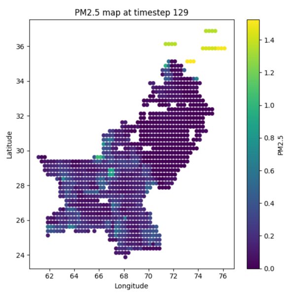
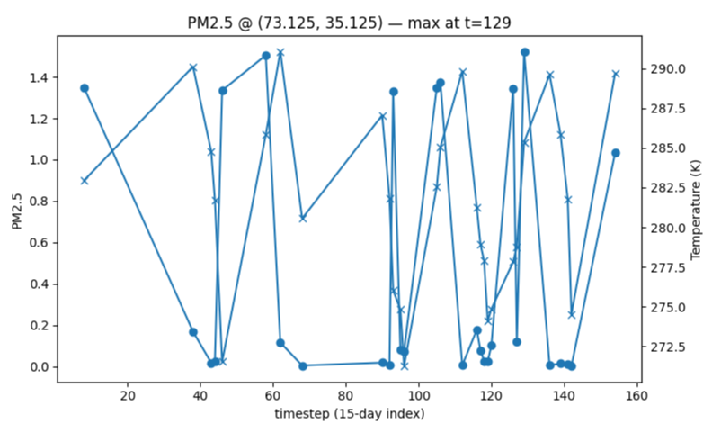
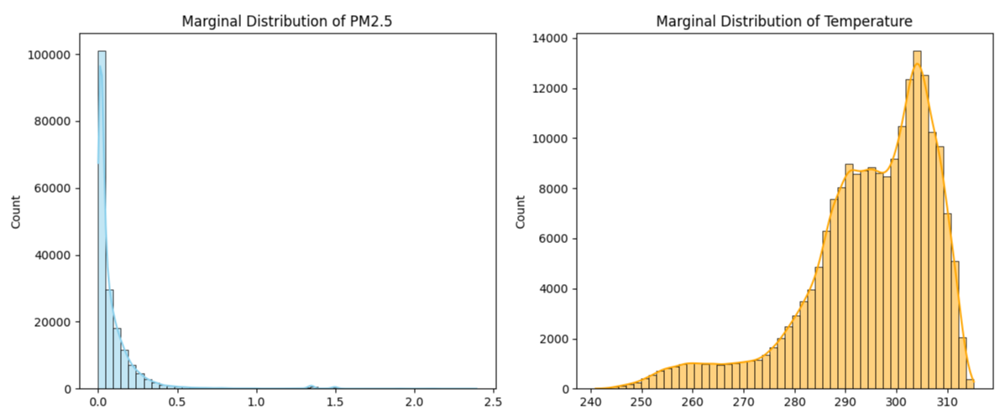
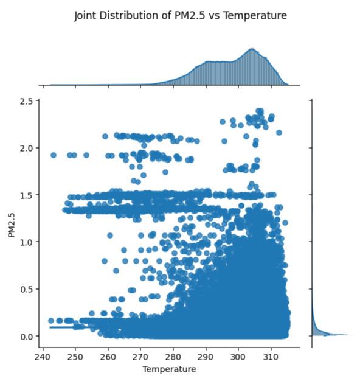
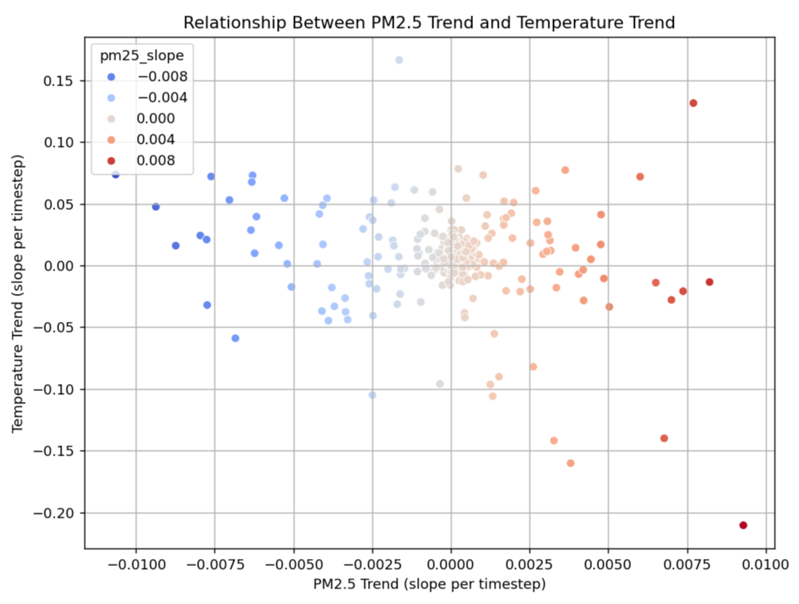

# PM2.5 vs Temperature

.

# PM2.5 map at timestep 129

.

# PM2.5 max at timestep 129

.

# Marginal Distribution of PM2.5 and Temperature

.

# Joint Distribution of PM2.5 and Temperature

.

# Pairwise relationships of PM2.5 and Temperature

.

# Relationship between PM2.5 trend and temp trend

.

